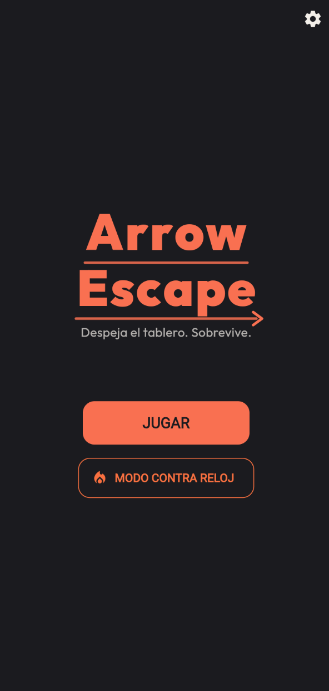
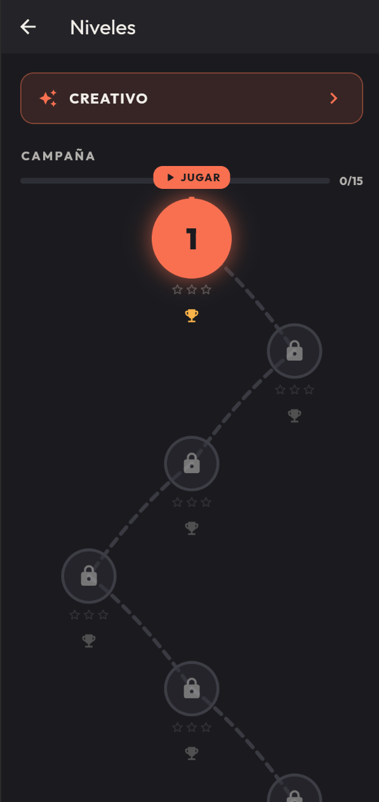
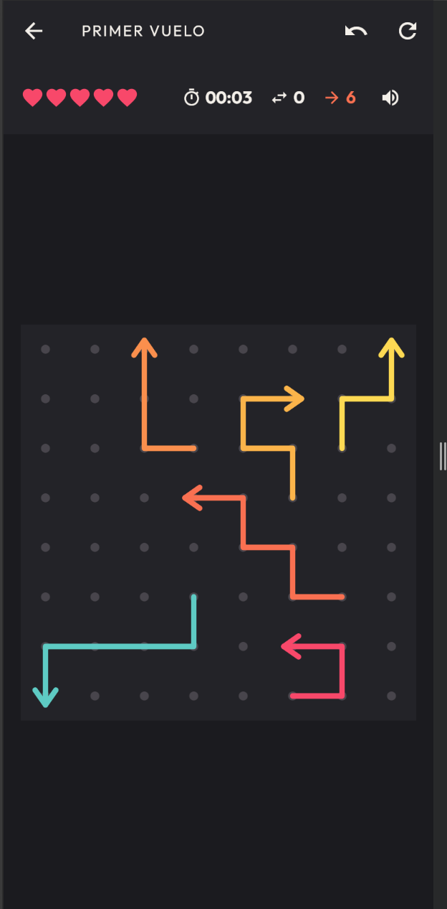
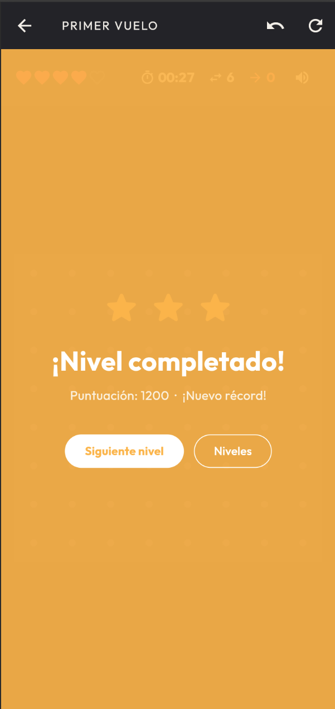
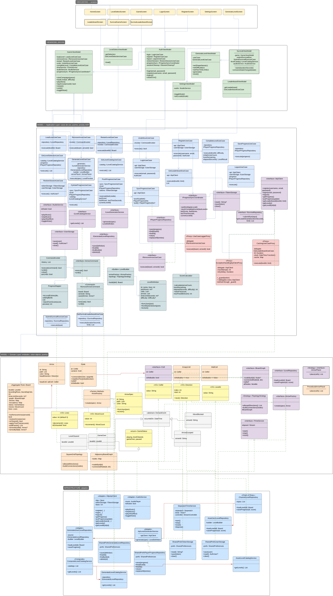

# 🧩 Arrow Maze — Escape Puzzle · Cliente Flutter

[](https://github.com/ACifuentesH/ucab-arrowmaze-mobile/actions/workflows/ci.yml)


[](LICENSE)

**Arrow Maze** es un juego de puzzles móvil: el tablero es una silueta (un corazón, un rombo, una torre…) cubierta de flechas entrelazadas. Tocar una flecha la hace deslizarse en la dirección de su cabeza — si el carril está libre, escapa del tablero; si otra flecha la bloquea, pierdes una vida. Ganas al vaciar el tablero. Simple de aprender, endiablado de ordenar.

Proyecto semestral de Desarrollo de Software (UCAB). Este repo es el **cliente Flutter**; el backend REST vive en [`ucab-arrowmaze-api`](https://github.com/LevinJimenez/ucab-arrowmaze-api) y está desplegado en Railway.

---

## Demo

| Home | Campaña | Tablero | Victoria |
|---|---|---|---|
|  |  |  |  |

> Capturas tomadas sobre el build web (`flutter run -d chrome`) contra el backend de producción. Ver también el modo creativo (`GenerateLevelScreen`) y Supervivencia (`SurvivalGameScreen`) en las capturas adicionales de [`docs/screenshots/`](docs/screenshots/).

---

## Índice

- [Demo](#demo)
- [Funcionalidades](#funcionalidades)
- [Cómo ejecutar](#cómo-ejecutar)
- [Arquitectura](#arquitectura)
- [Diagramas](#diagramas)
- [SOLID Principles](#solid-principles)
- [Comunicación con el backend](#comunicación-con-el-backend)
- [Los niveles: fuente de verdad y fallback offline](#los-niveles-fuente-de-verdad-y-fallback-offline)
- [Generación de niveles con IA](#generación-de-niveles-con-ia)
- [Construcción del tablero: grafo, nodos y flechas](#construcción-del-tablero-grafo-nodos-y-flechas)
- [Mecánica de juego y puntuación](#mecánica-de-juego-y-puntuación)
- [Patrones de diseño](#patrones-de-diseño)
- [Programación Orientada a Aspectos (AOP)](#programación-orientada-a-aspectos-aop)
- [Testing](#testing)
- [Pipeline de CI](#pipeline-de-ci)
- [UI, tema y audio](#ui-tema-y-audio)
- [Internacionalización](#internacionalización)
- [Uso de IA en el desarrollo](#uso-de-ia-en-el-desarrollo)
- [Flujo de trabajo y convenciones](#flujo-de-trabajo-y-convenciones)
- [Estructura del proyecto](#estructura-del-proyecto)
- [Documentación adicional](#documentación-adicional)
- [License](#license)

---

## Funcionalidades

| Funcionalidad | Descripción | Dónde vive |
|---|---|---|
| 🗺️ **Campaña de 15 niveles** | Progresión con desbloqueo secuencial, estrellas (1–3) y mejor puntuación por nivel. Tableros con formas reconocibles (rombo, torre, corazón…) de hasta 220 celdas. | `assets/levels/` + backend |
| 🤖 **Generador de niveles con IA** | El usuario describe una forma libre ("un gato", "una nave espacial"), un LLM dibuja la silueta y un algoritmo determinista la cubre de flechas **siempre resolubles**. | `GenerateLevelScreen` |
| 🔥 **Modo Supervivencia** | Contrarreloj de 120s: tableros aleatorios encadenados, cuenta de tableros resueltos y leaderboard global propio. | `SurvivalGameScreen` |
| 👤 **Autenticación JWT** | Registro/login contra el backend, restauración de sesión al arrancar, y **modo invitado** completo (el juego nunca exige cuenta). | `LoginScreen`, `RegisterScreen` |
| ☁️ **Sincronización de progreso** | Bidireccional: al autenticar se descarga el progreso remoto (pull); al completar nivel se sube (push). Fallos de red jamás rompen la partida — el progreso local es la red de seguridad. | `ProgressSyncCoordinator` |
| 🏆 **Leaderboards** | Por nivel (top-10 con caché TTL de 30s) y de supervivencia (mejor corrida por jugador). | `LeaderboardScreen` |
| ↩️ **Deshacer** | Undo real de movimientos vía patrón Command. | `CommandInvoker` |
| 🌐 **i18n** | Español e inglés, conmutables en caliente desde Ajustes. | `lib/l10n/` |
| 🔊 **Audio** | Música ambiental + 5 efectos sintetizados proceduralmente (sin assets de terceros), con mute persistente. | `AudioService` |
| 📴 **Offline-first** | Sin red: campaña bundleada, progreso local, niveles generados guardados en el dispositivo. Con red: el backend manda. | `RemoteFirstLevelCatalogService` |

## Cómo ejecutar

**Requisitos:** Flutter 3.44.2 (Dart 3.12+). Verificar con `flutter --version`.

```bash
flutter pub get
flutter run                       # usa el backend de producción (Railway)
```

La URL del backend se inyecta en tiempo de build (default: producción):

```bash
# Contra un backend local (docker compose up en ucab-arrowmaze-api):
flutter run --dart-define=API_BASE_URL=http://localhost:3000     # web/desktop
flutter run --dart-define=API_BASE_URL=http://10.0.2.2:3000      # emulador Android
```

```bash
flutter analyze --no-fatal-infos   # análisis estático (0 errores/warnings)
flutter test                       # 261 pruebas
flutter build web --release        # build de producción (igual que CI)
```

## Arquitectura

**Clean Architecture de 4 capas + MVVM** en presentación, con **Riverpod** como contenedor de inyección de dependencias. La regla de oro: las dependencias del código fuente solo apuntan hacia adentro.

```
┌─────────────────────────────────────────────────────────────┐
│  presentation  (MVVM: Screens + ViewModels/StateNotifier)   │
│      │ watch/read                                           │
│      ▼                                                      │
│  application   (Use Cases · DTOs · Puertos · Proxies AOP)   │
│      │                                                      │
│      ▼                                                      │
│  domain        (Board · Arrow · VOs · Eventos · Reglas)     │
│      ▲                                                      │
│      │ implementa puertos                                   │
│  infrastructure (HTTP · SharedPreferences · Assets · Audio) │
│                                                             │
│  config = composition root (providers.dart cablea TODO)     │
└─────────────────────────────────────────────────────────────┘
```

| Capa | Carpeta | Qué contiene | Qué NO puede hacer |
|---|---|---|---|
| **Domain** | `lib/domain/` | `Board` (agregado raíz, único punto de mutación), `Arrow`, `Node`, celdas, value objects (`CellId`, `Direction`, `Lives`, `MoveCount`), eventos de dominio, reglas de juego puras, `ProceduralArrowPlacer` | Importar Flutter, red o almacenamiento. Es Dart puro, testeable en total aislamiento. |
| **Application** | `lib/application/` | 25+ casos de uso, DTOs de frontera, **puertos** (interfaces `I*`), builders del contrato de nivel, comandos (undo), proxies AOP, `ScoreCalculator` | Conocer implementaciones concretas: solo habla con puertos. |
| **Infrastructure** | `lib/infrastructure/` | Adapters que implementan los puertos: `HttpApiClient`, repositorios sobre `SharedPreferences`, catálogos de niveles (assets/backend/generados), `AudioService` | Contener lógica de negocio. Solo traduce. |
| **Presentation** | `lib/presentation/` | 10 pantallas + 8 ViewModels (`StateNotifier` con estado inmutable), `BoardPainter` (canvas custom) | Llamar infraestructura directamente: solo consume casos de uso vía providers. |
| **Config** | `lib/config/` | `providers.dart` — el **único** archivo que conoce las 4 capas y conecta puerto ↔ implementación. Tema y URL del API. | — |

**MVVM en la práctica:** cada pantalla observa un `StateNotifier` que emite un estado inmutable (`GameState`, `AuthState`, `SurvivalState`…) con `copyWith`. Los eventos de dominio (`ArrowEscaped`, `MoveBlocked`, `LevelCleared`, `GameOver`) los acumula el `Board` y los consume `GameViewModel` (pull), que reacciona disparando audio, animaciones y persistencia — el dominio no sabe que la UI existe.

📐 Documento extendido con inventario de clases y flujos completos: [`docs/ARCHITECTURE.md`](docs/ARCHITECTURE.md).

## Diagramas

**Diagrama de clases** — las 4 capas, cada clase con su color/estereotipo de capa, los patrones de diseño marcados con `«estereotipo»`, y todas las relaciones (implementación, asociación, realización):



> Fuente editable (Lucidchart, se mantiene actualizado con el código): [Arrow Maze — Diagrama de Clases MVVM + Clean Architecture](https://lucid.app/lucidchart/6bd23f38-534f-480a-955d-46627acd9659/edit). Exportado como SVG en [`docs/class-diagram.svg`](docs/class-diagram.svg).

**Diagrama de capas Clean Architecture** — mismo documento, primera página: las 4 capas concéntricas con la dirección de la regla de dependencia y los puertos/adaptadores marcados entre capas. Ver la página 1 del Lucidchart enlazado arriba.

## SOLID Principles

Cada principio, con un ejemplo real y citable del código de este repo (no genérico):

| Principio | Ejemplo real en este repo |
|---|---|
| **S** — Single Responsibility | `ScoreCalculator` (`lib/application/services/score_calculator.dart`) solo calcula puntaje — no persiste, no renderiza. `GameViewModel` orquesta el juego y delega el cálculo, nunca lo hace él mismo. |
| **O** — Open/Closed | `ITopologyStrategy` (`lib/domain/ports/i_topology_strategy.dart`): agregar una topología hexagonal o 3D es una clase nueva que la implementa — cero cambios en `Board`, `LevelBuilder` ni ningún caso de uso existente. |
| **L** — Liskov Substitution | Los 3 proxies AOP (`ExceptionHandlingApiClientProxy`, `CachingUseCaseProxy`, `UseCaseLoggerProxy`) implementan exactamente la misma interfaz que envuelven — son sustituibles 1:1 por la implementación real en cualquier punto donde se inyectan, sin que el consumidor note diferencia de comportamiento observable. |
| **I** — Interface Segregation | `IRemoveArrowUseCase` (`lib/application/use_cases/i_remove_arrow_use_case.dart`) expone un solo método. No existe una interfaz "gorda" de operaciones del juego que obligue a implementar métodos que un consumidor no necesita. |
| **D** — Dependency Inversion | Todo `lib/config/providers.dart`: cada caso de uso depende de un puerto (`I*`), nunca de una implementación concreta. La inyección real (`HttpApiClient`, `SharedPrefs*`, etc.) ocurre solo en ese archivo — el único que conoce las 4 capas a la vez. |

## Comunicación con el backend

Todo el tráfico pasa por **un solo puerto**, `IApiClient` (`lib/application/ports/i_api_client.dart`), implementado por `HttpApiClient` y envuelto en proxies AOP transparentes:

```
Use Cases ──► IApiClient (puerto)
                  │
                  ▼
      ExceptionHandlingApiClientProxy      ← reintentos + normalización de errores
                  │
                  ▼
             HttpApiClient                 ← única clase que conoce HTTP
                  │        Authorization: Bearer <JWT> (solo rutas protegidas)
                  ▼
      ucab-arrowmaze-api (Railway)         ← envelope { success, data, message }
```

| Método | Endpoint | Auth |
|---|---|---|
| `register` / `login` / `logout` | `POST /auth/register` · `POST /auth/login` · local | — |
| `getProgress` / `putProgress` | `GET /progress` · `PUT /progress` | JWT |
| `getLeaderboard(levelId)` | `GET /leaderboard/:levelId` | — |
| `getLevels` / `getLevelById` | `GET /levels` · `GET /levels/:id` | — |
| `submitSurvival` / `getSurvivalLeaderboard` | `POST /survival` · `GET /survival/leaderboard` | JWT / — |
| `generateLevel` | `POST /levels/generate` (el backend llama al LLM) | JWT |

Los errores HTTP se traducen a una jerarquía **sellada** (`sealed class ApiError`: `UnauthorizedError`, `NotFoundError`, `ConflictError`, `ValidationError`, `ServerError`, `NetworkError`) — las capas superiores nunca ven códigos HTTP ni JSON crudo de validación, y el compilador obliga a manejar todos los casos.

## Los niveles: fuente de verdad y fallback offline

El **backend es la fuente de verdad del contenido** de la campaña (tabla `level_definitions`, sembrada vía `scripts/seed-levels.mjs` del repo del API), pero el **manifest local manda en el orden**: `GET /levels` devuelve orden lexicográfico (`level_1, level_10, …, level_2`) y la regla de desbloqueo encadena niveles en el orden del catálogo — consumirlo crudo rompería la progresión.

`RemoteFirstLevelCatalogService` fusiona ambos mundos:

| Caso | Resultado |
|---|---|
| Nivel en backend y en assets | Gana el **contenido remoto**, en la **posición local** (editar un nivel en la DB se refleja sin republicar la app) |
| Nivel solo en assets (seed incompleto) | Se sirve el bundleado — nunca desaparece un nivel jugable |
| Nivel solo en backend | Se **anexa al final** de la campaña (publicar niveles nuevos sin actualizar la app) |
| Backend caído o vacío | Campaña bundleada intacta (offline-first) |

Para cargar un tablero, `ChainedLevelRepository` (Chain of Responsibility) intenta en orden: **backend → generados locales → assets**.

## Generación de niveles con IA

La responsabilidad está repartida deliberadamente — la IA solo dibuja; las reglas del juego nunca salen del dominio:

```
Usuario: "un cohete", dificultad, ¿límite de tiempo?
   │
   ▼  POST /levels/generate (JWT, rate-limited)
Backend: LLM (Claude) dibuja la SILUETA como grid ASCII → devuelve { cells }
   │
   ▼
ProceduralArrowPlacer (dominio, determinista):
   cubre la silueta COMPLETA de flechas siempre resolubles
   — algoritmo de "pelado en orden de resolución": cada flecha se coloca con
   su rayo de escape libre de celdas aún no peladas, garantizando que existe
   un orden de toque que vacía el tablero; heurística Warnsdorff para no
   dejar celdas huérfanas; reintenta hasta 40 semillas y corta en cobertura 100%.
   │
   ▼
LevelBuilder valida invariantes → se persiste local → jugable al instante
```

¿Por qué así? El backend trata el nivel como JSON opaco (no conoce la mecánica); duplicar el modelo de resolubilidad en el servidor sería dos implementaciones de las mismas reglas divergiendo en silencio. Las flechas que proponga el LLM **se descartan**: la resolubilidad no se le confía a un modelo probabilístico.

## Construcción del tablero: grafo, nodos y flechas

El tablero **nunca se modela como una matriz `board[fila][columna]`**. Es un grafo: un conjunto de `Node` que se conocen entre sí por dirección ("mi vecino al norte es tal celda"), no por coordenadas. Esta decisión es la que permite que siluetas arbitrarias (un corazón, un rombo, una torre) funcionen sin ningún caso especial — si una celda no pertenece a la forma, simplemente no existe ningún nodo para ella y el grafo nunca la referencia.

`LevelBuilder.build(definition)` (patrón Builder) ensambla el `Board` en este orden:

1. **Nodos** — por cada `[fila, columna]` en `definition.cells` crea un `Node` (`lib/domain/entities/node.dart`) envolviendo una `EmptyCell`. La lista `cells` **es** la forma del tablero.
2. **Conexiones** — delega en `ITopologyStrategy` (`lib/domain/ports/i_topology_strategy.dart`), implementada hoy por `SquareGridTopology` (`lib/domain/services/square_grid_topology.dart`): revisa los 4 vecinos ortogonales de cada nodo y conecta los que también pertenecen a la forma. Devuelve un `IBoardGraph` (`AdjacencyBoardGraph`, `lib/domain/services/adjacency_board_graph.dart`) — una tabla de consulta "desde este nodo, en esta dirección, se llega a este otro nodo (o al borde)". Toda la geometría del tablero está aislada en esta única Strategy; cambiarla a una cuadrícula hexagonal no afecta ninguna otra clase del dominio.
3. **Flechas** — por cada `ArrowSpec` en `definition.arrows`, `IArrowFactory`/`ArrowFactory` (`lib/domain/factories/`) construye la entidad `Arrow` final: convierte las coordenadas del `path` a `CellId` y **calcula** la dirección de la cabeza comparando las dos últimas celdas del camino (no viene dada explícitamente en el contrato).
4. **Validación** — `LevelBuilder` verifica que cada celda del `path` de una flecha pertenezca al tablero, que ninguna celda esté ya ocupada por otra flecha, y que cada par de celdas consecutivas sea ortogonalmente adyacente.
5. **Ensamblaje** — se construye el `Board` (`lib/domain/aggregates/board.dart`, Aggregate Root) con el grafo, el mapa de flechas, el mapa de ocupación, las vidas y el límite de tiempo.

Una vez construido, `Board.tryRemoveArrow(arrowId)` es el único punto de mutación del juego: camina el grafo celda por celda desde la cabeza de la flecha en su dirección (`_isPathClear`), preguntando si cada celda está libre, hasta salir del tablero (la flecha escapa) o toparse con una celda ocupada o una pared (el movimiento se bloquea).

## Mecánica de juego y puntuación

- **Mover:** tocar una flecha → se desliza hacia su cabeza. Carril libre = escapa; bloqueada = animación de shake y **−1 vida**.
- **Victoria:** tablero vacío. **Derrota:** vidas en 0 o tiempo agotado (en niveles con límite).
- **Puntuación** (`ScoreCalculator`, función pura):

  ```
  score = (flechas×100 + vidas_restantes×150 + segundos_restantes×10) × multiplicador
  multiplicador: easy ×1.0 · medium ×1.5 · hard ×2.0
  estrellas: ≥85% del máximo → ⭐⭐⭐ · ≥55% → ⭐⭐ · resto → ⭐
  ```

- El **undo** restaura la flecha y devuelve el movimiento (no devuelve vidas perdidas).

## Patrones de diseño

| Patrón | Categoría | Implementación | Papel |
|---|---|---|---|
| **Factory Method** | Creacional | `ArrowFactory` | Construye `Arrow` desde `ArrowSpec` validando el path |
| **Builder** | Creacional | `LevelBuilder` | Ensambla el agregado `Board` desde `LevelDefinition` |
| **Singleton** | Creacional | `AudioService` | Una sola instancia de reproductores de audio |
| **Strategy** | Comportamiento | `ITopologyStrategy`/`SquareGridTopology` · `IArrowPlacer`/`ProceduralArrowPlacer` | Geometría del tablero y colocación de flechas intercambiables |
| **Command** | Comportamiento | `IArrowCommand`, `RemoveArrowCommand`, `CommandInvoker` | Movimientos como objetos → undo real |
| **Observer** | Comportamiento | Eventos de dominio + Riverpod | El `Board` emite eventos; ViewModels y UI reaccionan sin acoplarse |
| **Adapter** | Estructural | `HttpApiClient`, `AudioService`, `RemoteJsonLevelRepository` | Traducen tecnología externa a puertos internos |
| **Facade** | Estructural | `AudioService` | Un método por efecto oculta N `AudioPlayer` |
| **Proxy** ×3 | Estructural | Ver [AOP](#programación-orientada-a-aspectos-aop) | Sustitución transparente de la interfaz envuelta |
| **Chain of Responsibility** | Comportamiento | `ChainedLevelRepository` | backend → generados → assets, el primero que responde gana |
| **Composite** | Estructural | `CompositeLevelCatalogService` | N catálogos de niveles se consumen como uno |
| **Decorator** | Estructural | `RemoteFirstLevelCatalogService` | Añade fusión remoto/local sobre el puerto de catálogo sin tocarlo |

## Programación Orientada a Aspectos (AOP)

Tres aspectos transversales implementados como **proxies transparentes** — cada uno implementa la misma interfaz que envuelve, así que Riverpod los inyecta sin que ningún consumidor sepa que existen:

| Aspecto | Clase | Qué intercepta | Comportamiento |
|---|---|---|---|
| **Logging** | `UseCaseLoggerProxy` | `IRemoveArrowUseCase` | Registra cada movimiento (id, resultado, duración) sin ensuciar el caso de uso |
| **Manejo de excepciones** | `ExceptionHandlingApiClientProxy` | `IApiClient` (los 11 métodos) | Normaliza cualquier excepción de transporte a `NetworkError` tipado y **reintenta solo fallos transitorios** (2 intentos, 300ms) — nunca un 404/422, que fallarían igual |
| **Caché** | `CachingUseCaseProxy` | `GetLeaderboardUseCase` | Memoiza por `(levelId, limit)` con TTL de 30s; refrescar la pantalla no golpea la red. Reloj inyectable para testear la expiración sin esperas |

```dart
// config/providers.dart — el aspecto se compone en el cableado, no en el código de negocio
final apiClientProvider = Provider<IApiClient>(
  (ref) => ExceptionHandlingApiClientProxy(
    delegate: HttpApiClient(...),
  ),
);
```

**¿Por qué Proxy y no Decorator?** GoF define ambos patrones con la misma estructura UML — la diferencia es la intención. *Decorator* está pensado para **componerse**: varios envoltorios apilados, en la combinación que el cliente elija. *Proxy* es **un único envoltorio, fijo y obligatorio** — la única forma sancionada de acceder al objeto real; GoF incluso nombra la variante *"Smart Reference"*: un proxy que consulta una caché antes de delegar, exactamente el caso de `CachingUseCaseProxy`. En este repo, cada puerto se envuelve **una sola vez** (ver `providers.dart`: nunca hay dos proxies apilados sobre el mismo objeto) — de ahí el nombre.

El backend (`ucab-arrowmaze-api`) resuelve el mismo problema con **Decorator genérico**: como todos sus casos de uso implementan un contrato uniforme `IUseCase<TInput, TOutput>`, un único `LoggingUseCaseDecorator<TInput, TOutput>` sirve para los 9 casos de uso del sistema, y se **apilan** explícitamente (`CachingUseCaseDecorator(ExceptionHandlingUseCaseDecorator(LoggingUseCaseDecorator(useCase)))` vía el helper `withAop()` en `src/app.ts`). El frontend no tiene ese contrato uniforme entre casos de uso (cada uno define su propia firma), así que el mismo principio de AOP se aplicó de forma específica por interfaz en vez de genérica — misma disciplina de diseño, dos costos de entrada distintos según qué tan uniforme sea el contrato base de cada repositorio.

## Testing

**261 pruebas** organizadas según la metodología obligatoria del equipo ([`docs/testing-architecture.md`](docs/testing-architecture.md)): tres niveles de abstracción que separan **qué** se prueba de **cómo** se prueba.

```
Nivel 1 · Test            →  lenguaje de negocio, Given/When/Then encadenado
Nivel 2 · Testing API     →  test/_support/apis/*_test_api.dart (28 APIs)
                             esconde construcción, fakes y aserciones
Nivel 3 · Object Mother   →  test/_support/mothers/ — instancias canónicas
                             (BoardMother, LevelDefinitionMother, ArrowMother…)
```

```dart
test('should_fall_back_to_bundled_levels_when_backend_is_unreachable', () async {
  final api = RemoteCatalogTestApi()
      .givenABundledCampaignInOrder(['level_1', 'level_2'])
      .givenTheBackendIsUnreachable();

  await api.whenTheCatalogIsRequested();

  api.thenTheCatalogOrderShouldBe(['level_1', 'level_2']);
});
```

**Reglas del equipo:**
- Nombres `should_[resultado]_when_[condición]` — el test es documentación ejecutable.
- **Estado sobre interacción:** se afirma sobre el resultado, no sobre "se llamó X". Excepción documentada: los proxies AOP, donde la interacción (¿reintentó? ¿sirvió de caché?) *es* el comportamiento observable — ahí se usa `mocktail`.
- **Fakes sobre mocks** para puertos de persistencia (implementaciones in-memory en `test/_support/fakes/`).
- **Resolubilidad garantizada:** `campaign_levels_test.dart` construye los 15 niveles reales y demuestra con un solver greedy que cada uno tiene solución — un nivel imposible no pasa el pipeline.
- Cobertura por capa: dominio puro sin mocks; casos de uso con fakes; ViewModels con casos de uso falsos; navegación entre pantallas con `testWidgets` y `Key`s estables.

```bash
flutter test                                    # toda la suite
flutter test test/domain/                       # solo dominio
flutter test --name should_fall_back            # un caso puntual
```

## Pipeline de CI

`.github/workflows/ci.yml` — espejo del pipeline del backend. Corre en cada push a `main`/`develop`/`feature/**` y en cada PR:

```
checkout → Flutter 3.44.2 (cache) → pub get --enforce-lockfile
        → flutter analyze --no-fatal-infos     # errores y warnings ROMPEN el build
        → flutter test                          # 261 pruebas
        → flutter build web --release           # el artefacto compila de verdad
```

`concurrency` cancela corridas obsoletas del mismo branch. El lockfile estricto garantiza que CI prueba exactamente las versiones commiteadas.

## UI, tema y audio

- **Paleta "Sunset Cálido"** centralizada en `ThemeConfig` (`lib/config/theme_config.dart`): fondo `#1B1B1F`, primario `#FF6B4A`, acentos `#FFB238`/`#FF3D68` — ninguna pantalla hardcodea colores.
- **Tipografía [Outfit](https://fonts.google.com/specimen/Outfit)** (variable, licencia OFL) aplicada globalmente.
- **Tablero como canvas custom** (`BoardPainter`/`BoardView`): la silueta se dibuja con puntos de fondo densos, flechas multi-celda con cabeza/cuerpo continuos, animación de escape (520ms, `easeIn`) y shake en bloqueo.
- **Logo animado** en Home (trazo tipo "flecha que escribe") y overlay de victoria que espera a que la última flecha termine de salir (`deferLevelCleared` en `GameState`).
- **Audio 100% procedural**: los 6 WAV (música ambiental + 5 SFX) se sintetizaron con un script propio — cero assets de terceros, cero problemas de licencia.

## Internacionalización

Español e inglés vía `flutter_localizations` + ARB (`lib/l10n/app_es.arb`, `app_en.arb`). El idioma se cambia en caliente desde Ajustes (`SettingsViewModel` → `MaterialApp.locale`). Los mensajes de error del backend llegan como **códigos estables** (ej. `invalid_email`) y se traducen en la capa de presentación — nunca se muestra texto crudo del servidor.

## Uso de IA en el desarrollo

Requisito del proyecto, documentado exhaustivamente en [`AI_USAGE.md`](AI_USAGE.md): **20 entradas** que registran cada uso de IA (Claude Code) con el prompt, el resultado, las modificaciones del equipo y las lecciones aprendidas — incluyendo los errores de la IA que el proceso atrapó (un nivel circular irresoluble detectado por el test de resolubilidad, un commit accidental con rutas de máquina, etc.).

- **~85% del código** se escribió con asistencia de IA, bajo arquitectura, contratos y revisión definidos por el equipo.
- Toda contribución de IA pasa por la misma puerta: la suite de tests.
- La IA también es **funcionalidad del producto**: el generador de niveles descrito [arriba](#generación-de-niveles-con-ia).

## Flujo de trabajo y convenciones

- **Gitflow:** `main` (estable) ← `develop` (integración) ← `feature/*` · `fix/*`. Todo cambio entra por PR a `develop`; `develop` se promociona a `main` por PR.
- **Conventional Commits** en inglés: `feat(levels): …`, `fix(survival): …`, `chore: …`.
- **CI verde obligatorio** para mergear.
- Trabajo paralelo del equipo con worktrees y ramas por feature (ver historial de PRs).

## Estructura del proyecto

```
lib/
├── domain/            # Capa 1 — reglas de negocio puras (0 imports de Flutter)
│   ├── aggregates/    #   Board: agregado raíz, único punto de mutación
│   ├── entities/      #   Arrow, Node, celdas
│   ├── value_objects/ #   CellId, Direction, LevelId, Lives, MoveCount
│   ├── events/        #   ArrowEscaped, MoveBlocked, LevelCleared, GameOver
│   ├── factories/     #   ArrowFactory (+ ArrowSpec)
│   ├── services/      #   ProceduralArrowPlacer, SquareGridTopology, grafo
│   └── ports/         #   ILevelRepository, IArrowPlacer, ITimeService…
├── application/       # Capa 2 — orquestación
│   ├── use_cases/     #   auth/ · progress/ · leaderboard/ · survival/ · juego
│   ├── ports/         #   IApiClient, IAudioService, ILevelCatalogService…
│   ├── proxies/       #   los 3 aspectos AOP
│   ├── builders/      #   LevelBuilder, LevelDefinition (contrato de nivel)
│   ├── commands/      #   RemoveArrowCommand + CommandInvoker (undo)
│   └── dtos/ · enums/ · errors/ · mappers/ · services/
├── infrastructure/    # Capa 3 — adapters
│   ├── api/           #   HttpApiClient (único punto HTTP)
│   ├── catalog/       #   Asset · Backend · Generated · Composite · RemoteFirst
│   ├── repositories/  #   Remote · Asset · Generated · Chained · SharedPrefs*
│   └── services/      #   AudioService, ApiLevelGeneratorService, Stopwatch
├── presentation/      # Capa 4 — MVVM
│   ├── view_models/   #   8 StateNotifiers con estado inmutable
│   └── views/         #   10 screens + widgets (BoardPainter, HUD, logo)
├── config/            # Composition root: providers.dart, tema, API url
└── l10n/              # ARB + localizaciones generadas (es/en)

test/
├── _support/          # Testing APIs (28) · Object Mothers · Fakes
├── domain/ · application/ · infrastructure/ · presentation/
assets/
├── levels/            # 15 niveles de campaña + manifest.json (orden oficial)
├── audio/             # música + sfx/ (WAV procedurales)
└── fonts/             # Outfit (OFL)
```

## Documentación adicional

| Documento | Contenido |
|---|---|
| [`docs/ARCHITECTURE.md`](docs/ARCHITECTURE.md) | Arquitectura extendida: inventario clase por clase, flujos completos (login, jugar, generar con IA, survival), índice "¿dónde vive X?" |
| [`docs/class-diagram.svg`](docs/class-diagram.svg) | Diagrama de clases completo (entregable obligatorio) — fuente editable en Lucidchart enlazada arriba |
| [`docs/testing-architecture.md`](docs/testing-architecture.md) | La metodología de testing completa con ejemplos |
| [`docs/backend-context.md`](docs/backend-context.md) | Contrato REST del backend endpoint por endpoint |
| [`docs/DEVELOPMENT_PLAN.md`](docs/DEVELOPMENT_PLAN.md) | Auditoría contra la rúbrica y backlog del proyecto |
| [`AI_USAGE.md`](AI_USAGE.md) | Bitácora completa del uso de IA en el desarrollo |

---

## Equipo

UCAB · Desarrollo de Software · 2026

- **Alejandro Cifuentes** — [@ACifuentesH](https://github.com/ACifuentesH)
- **Levin Jiménez** — [@LevinJimenez](https://github.com/LevinJimenez)
- **Zarah Roa** [@Zarah77](https://github.com/zarah77)

Cliente móvil: [ACifuentesH/ucab-arrowmaze-mobile](https://github.com/ACifuentesH/ucab-arrowmaze-mobile) · Backend: [LevinJimenez/ucab-arrowmaze-api](https://github.com/LevinJimenez/ucab-arrowmaze-api)

## License

[MIT](LICENSE)
